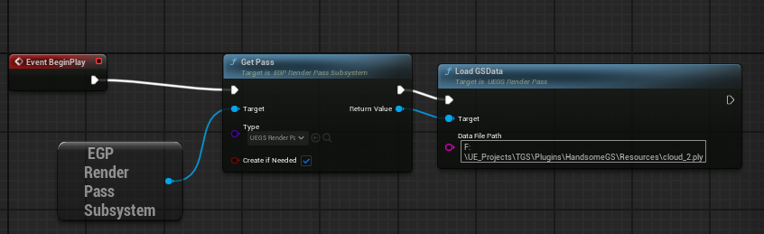
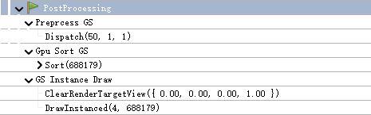
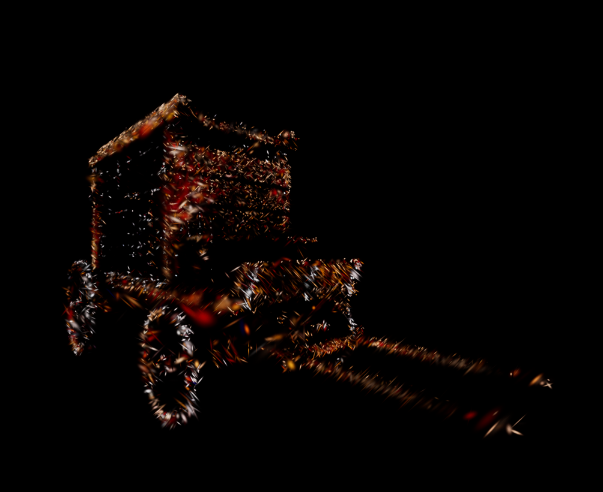
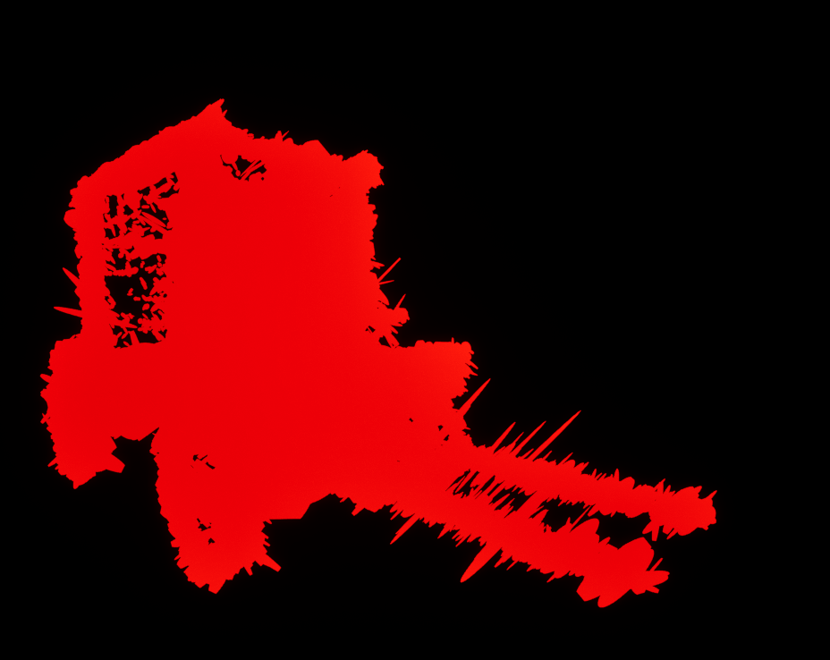

## Niagara Free 3DGS For UE5
该插件基于RDG和RHI开发，通过SVE(Scene View Extension)接入UEDeferred Rendering管线，实现高效3DGS渲染

## Dependency
- UE 5.5.4
- RHI: D3D11

## Component
### GSAsset
- UGSAsset : 保存ply文件中读取的GS点云信息
- FGSPoint : 单个GS点的信息，全部通过FVector4f存储，方便直接上传GPU buffer
    - Position : (px,py,pz, 1.0)
    - Scale : (sx,sy,sz,0.0)
    - Rotation : 四元数存储
    - DCA : (F_DC.r,F_DC.g,F_DC.b,Alpha)
    - SH
- FVertexAttribute : 预处理后映射到Clip Space的GS信息
    - Position : Clip Space Position
    - Axis ：(axis1_x,axis1_y,axis2_x,axis2_y)
    - ColorA : (color_r,color_g,color_b,alpha) 解析SH获得方向radiance color以及max alpha

### UEGS_RenderPass
- FUEGSRenderData : 能够生存multiframe的persistent data, 我们把所有要用到的gpu buffer都保存在其中，从而自行控制资源的生命周期
    - FUEGSRenderData(FRDGBuilder&GraphBuilder,const FViewInfo& ViewInfo,const FIntRect& viewportSubset, UGSAsset* GSAssetData) ：资源初始化
    - void Resample(FRDGBuilder&, const FViewInfo&, const FInt32Point& oldResolution, const FInt32Point& newResolution, const FInt32Point& oldToNewPixelOffset) : 窗口分辨率发生变化时调用

- F_UEGS_PassSVE ：接入pipeline的SVE类，通过实现不同virtual function来在Renderer的不同Stage接入
    - PrePostProcessPass_RenderThread：在预处理之前接入

- U_UEGS_RenderPass : 用于管理PersistentData和SVE的类，接入U_EGP_Subsystem
    - TSharedRef<F_EGP_RenderPassSceneViewExtension> InitThisPass_GameThread(UWorld& thisWorld) 创建对应的SVE并返回

### Shaders
- GSPreprocess : 预处理GS数据，包括解析SH，3D到2D映射
- GSRender : 通过instancing draw call绘制Quad

对于上述RenderPass,SVE,PersistentData使用有相关疑问可以参考ExtendedGraphicsProgramming仓库以及上面提到的博客，有相关案例可以参考

## Usage
在关卡蓝图中重写BeginPlay,获取EGP_RenderPass_Subsystem，调用Getpass创建我们的renderpass,然后调用Load GSData，填入ply文件路径即可

## References
- UnityGaussianSplatting : 基本和该插件使用相同思路 https://github.com/aras-p/UnityGaussianSplatting
- 3dgs.cpp : 3dgs的vulkan实现，基于屏幕空间 https://github.com/shg8/3DGS.cpp
- GaussianSplattingForUnrealEngine : 基于Niara的实现，可以参考Niagara System中相关Module的实现微调shader效果 https://github.com/Italink/GaussianSplattingForUnrealEngine
- diff-gaussian-rasterization : 原论文基于Cuda的实现 https://github.com/graphdeco-inria/diff-gaussian-rasterization

## Profile
该插件仅在Runtime渲染，所以将Play in Editor切换到Standalone Game模式后用Renderdoc的Attatch to Running instance连接独立窗口截帧，在postprocess中能够看到我们添加的pass (先在引擎的Project Setting中修改配置Renderdoc的attatch on startup以及Renderdoc路径，否则单独启动Renderdoc找不到对应Instance)

## Additional
- GSCompression下是基于spz的ply压缩模块，可以用来做GSAsset的序列化，为了方便测试暂时单独剥离出来，效果调整好后可以直接调用
- 在Resources文件夹下有一个cloud_2.ply模型文件可以用于测试

## TODO
- 调整RenderPass中的颜色输出，因为目前相关pass添加在PrePostProcessPass_RenderThread中，所以结果也会经过后处理，不一定能完全反映GS训练的效果，需要在GSRender.usf中进行调整
- 将Preprocess以及GPU排序的pass换到其他位置并改为AsyncCompute,提高GPU利用率
- 将GSAsset创建为Engine Custom Asset，并实现UEGS Component以及UEGS Actor，并在Subsystem中统一管理，处理不同UEGS Actor之间的遮挡关系
- 不一定需要每帧排序，对于重叠较少的模型可以设置每n帧排序一次
- 更紧凑的buffer排布，降低显存占用（运行时解压？）

## Tips
- UE中默认使用row-majored vector, 所以在shader中进行矩阵和向量运算遵循mul(vector,matrix)的方式而非mul(matrix,vector)
- RDG中绘制完整的raster pass时会同时依赖vertex shader参数和pixel shader参数，在外部声明一个shader parameter，然后在对应shader中替代FParameter即可将两个shader的参数用一个parameter struct表示，从而保证正确的依赖关系
- UE中ctrl+shift+.即可在Editor运行状态下编译着色器，不用重新编译整个项目
- 如果需要debug查看2dgs形状，直接修改GSRender.usf中的#define debug 1
- 我们使用2dgs quad互相遮盖来渲染，和原论文的screen space quad有一定区别，可以适当扩大每个quad的大小来保证效果，同时也不能太大导致过多overdraw，通过GSPreprocess.usf中的splatscale来调整。
- 我们虽然在Resources文件夹下提供了模型，但是直接输入这个路径似乎无法打开文件，建议将文件存储在项目文件夹以外的位置访问
- 用于测试的GS模型大小最好不要超过100w个gs点

## Current Result

  
  

## Capture & Train
- 图像采集用GaussianSplattingForUnrealEngine插件，即可在引擎内生成Colmap格式数据集
- 训练采用SpeedySplat的官方代码即可，https://github.com/j-alex-hanson/speedy-splat，通过调整OptimizationParams中的参数来控制Pruning的力度，从而获得更少gs数量的模型
